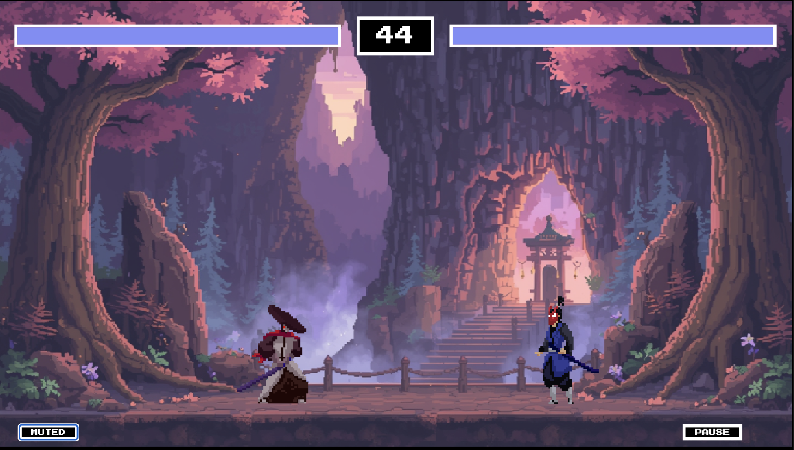
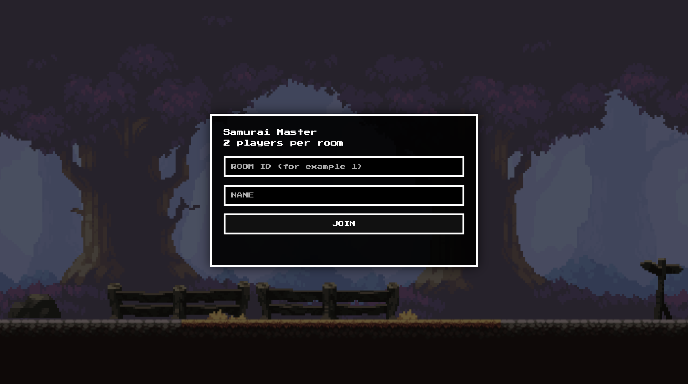
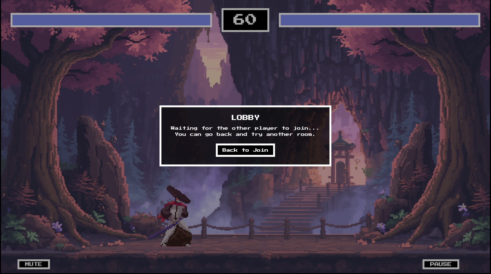
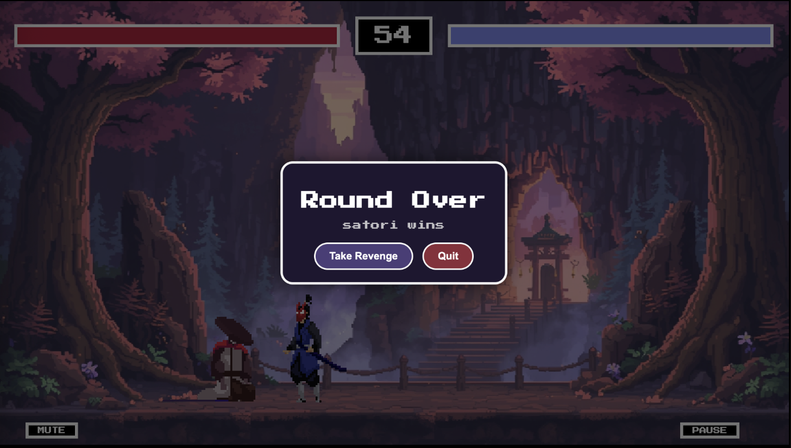
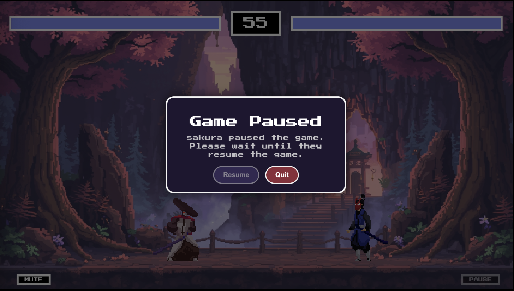

# 🎮 JS Multiplayer Fighting Game



A real-time **2D multiplayer fighting game** built with **Node.js, Express, and Socket.IO**. Battle opponents in real-time combat with movement, jumping, attacks, blocking, and strategic heart power-ups.

---

## 📋 Table of Contents

- [Features](#features)
- [Requirements](#requirements)
- [Installation](#installation)
- [Running the Server](#running-the-server)
- [How to Play](#how-to-play)
- [Game Mechanics](#game-mechanics)
- [Controls](#controls)
- [Project Structure](#project-structure)
- [Configuration](#configuration)

---

## ✨ Features

- **Real-time Multiplayer Combat** — Two players battle simultaneously with server-authoritative game logic
- **Two Unique Characters** — Play as **Samurai Mack** or **Kenji**, each with distinct animations and attack patterns
- **Strategic Combat System** — Master attacks, blocking, movement, and timing to outplay your opponent
- **Health & Healing** — Dynamically spawning hearts restore 15 HP when collected
- **Pause System** — Either player can pause; the pausing player can resume
- **Rematch System** — Both players can agree to fight again instantly

---

## 🔧 Requirements

- **Node.js** v16 or newer
- **npm** (comes with Node.js)
- **Modern browser** (Chrome, Firefox, Edge, Safari)
- Port **3000** available (or configure via `PORT` environment variable)

---

## 📦 Installation

1. **Clone the repository**

   ```bash
   git clone https://gitea.kood.tech/kirillasov/multi-player.git
   cd multi-player
   ```

2. **Install dependencies**
   ```bash
   npm install
   ```

---

## 🚀 Running the Server

### Quick Start

```bash
npm start
```

### Manual Start

```bash
node server/server.js
```

### Custom Port

```bash
PORT=8080 npm start
```

The server will output:

```
Server running: http://localhost:3000
```

**Then open your browser to `http://localhost:3000` and start playing!**

---

## 🎮 How to Play

### Joining a Room

1. Open `http://localhost:3000` in your browser
2. Enter a **Room ID** (e.g., `room1`, `duel-arena`, anything you want)
3. Enter your **Player Name**
4. Click **JOIN**



### Starting a Match

- When you join, you'll see a lobby screen waiting for an opponent
- The match **auto-starts** when a second player joins the same room
- Each room supports exactly **2 players**
- Players are randomly assigned to **Samurai** or **Kenji** character



### Winning

A match ends when:

- A player's health reaches **0 HP** (instant loss)
- The **60-second timer** expires (highest health wins)
- An opponent disconnects

After each match, you can:

- **Take Revenge** — Play another round immediately
- **Quit** — Return to the join screen



---

## ⚔️ Game Mechanics

### Combat System

| Mechanic            | Details                                      |
| ------------------- | -------------------------------------------- |
| **Attack Damage**   | 20 HP per hit                                |
| **Block Reduction** | Reduces damage to 4 HP (80% reduction)       |
| **Attack Duration** | 20 frames (~333ms at 60 FPS)                 |
| **Attack Cooldown** | 20 frames before next attack possible        |
| **Knockback**       | Attacker's position influences hit direction |

### Character Stats

Both Samurai and Kenji have identical core stats:

| Stat                | Value                 |
| ------------------- | --------------------- |
| **Starting Health** | 100 HP                |
| **Move Speed**      | 10 pixels/frame       |
| **Jump Power**      | -20 velocity (upward) |
| **Gravity**         | 1.2 pixels/frame²     |
| **Body Width**      | 50 px                 |
| **Body Height**     | 150 px                |

### Samurai Mack

- **Attack Pattern:** Wide 135×50px sweeping strikes
- **Animations:** 8-frame idle, 8-frame run, 6-frame attack
- **Aesthetic:** Traditional samurai with sword
- **Spawn Position:** Left side of arena

### Kenji

- **Attack Pattern:** Extended 170×50px reaching strikes
- **Animations:** 4-frame idle, 8-frame run, 4-frame attack
- **Aesthetic:** Ninja-inspired fighter
- **Spawn Position:** Right side of arena

### Heart Pickups

Hearts spawn automatically during gameplay when:

- Cumulative damage dealt ≥ 40 HP since last spawn
- At least 2 seconds have passed since the last hit
- At least 5 seconds have passed since the previous heart spawn
- At least one player is below 100 HP

**Effect:** Picking up a heart restores **15 HP** (max 100)

### Health System

- Players start with **100 HP**
- Health cannot exceed 100 even with pickups
- Health displays in real-time at top of screen
- Blocking reduces incoming damage but doesn't restore health

---

## 🎮 Controls

### Keyboard

| Key       | Action      | Notes                                              |
| --------- | ----------- | -------------------------------------------------- |
| **A**     | Move Left   | Cannot move while attacking or blocking            |
| **D**     | Move Right  | Cannot move while attacking or blocking            |
| **W**     | Jump        | Only works when on ground, not during attack/block |
| **Space** | Attack      | 20-frame cooldown between attacks                  |
| **Shift** | Block       | Reduces damage but prevents attacks & movement     |
| **M**     | Mute/Unmute | Toggle audio on/off                                |

### Game Actions

- **Pause** — Click "PAUSE" button or press ESC during match (only pausing player can resume)
- **Resume** — Only the player who paused can unpause
- **Quit** — Click "QUIT" button to return to join screen



---

## 🏗️ Project Structure

```
multi-player/
├── public/
│   ├── img/
│   ├── js/
│   │   ├── game.js                  # Main game loop & client logic
│   │   ├── classes.js               # Sprite & Fighter classes
│   │   ├── utils.js                 # Utility functions
│   │   ├── audio.js                 # Audio manager
│   │   ├── join.js                  # Join screen logic
│   │   ├── lobby.js                 # Lobby screen logic
│   │   ├── menu.js                  # Pause/post-game menu
│   │   └── net.js                   # Socket.IO networking
│   ├── index.html                   # Join/lobby page
│   ├── game.html                    # Game page
│   ├── join.css                     # Join screen styles
│   ├── lobby.css                    # Lobby styles
│   ├── menu.css                     # Menu styles
│   └── styles.css                   # Global styles
├── server/
│   ├── server.js                    # Main server, game loop, socket handlers
│   ├── rooms.js                     # Room management (optional)
│   └── gameState.js                 # Game state utilities (optional)
├── package.json                     # Dependencies & scripts
├── package-lock.json                # Dependency lock file
└── README.md                         # This file
```

---

## ⚙️ Configuration

### Environment Variables

Set these before running `npm start`:

```bash
# Custom port (default: 3000)
PORT=8080 npm start

# Enable debug logging
DEBUG=true npm start
```

### Server Configuration (server.js)

Edit these constants in `server/server.js` to customize gameplay:

```javascript
// Timing
const TICK_RATE = 60; // Server update rate (Hz)
const ROUND_SECONDS = 60; // Match duration (seconds)

// Game Balance
const DAMAGE = 20; // Damage per attack
const HEART_HEAL_AMOUNT = 15; // Health per heart pickup
const BLOCK_MULT = 0.2; // Block damage multiplier (20% = 4 damage taken)

// Physics
const GRAVITY = 1.2; // Downward acceleration
const JUMP_VY = -20; // Jump velocity
const SPEED_X = 10; // Movement speed per frame
const KB_POWER = 4; // Knockback magnitude
const KB_DECAY = 0.75; // Knockback slowdown per frame

// Combat Timing (in frames, 1 frame = ~16.67ms at 60 FPS)
const ATTACK_DURATION_TICKS = 20; // How long attack animation plays
const ATTACK_COOLDOWN_TICKS = 20; // Frames until next attack allowed

// Heart Spawning
const HEART_SPAWN_COOLDOWN = 5000; // Min ms between spawns
const HEART_DAMAGE_THRESHOLD = 40; // Damage dealt to trigger spawn
const HEART_SPAWN_DELAY_AFTER_HIT = 2000; // Delay after last hit
const HEART_LIFETIME = 1200 * (1000 / 60); // Frames hearts stay on field
```

---

## 🧪 Testing Multiplayer Locally

You can test the game on a single computer with two browser windows:

### Option 1: Two Tabs

1. Open `http://localhost:3000` in Tab 1
2. Open `http://localhost:3000` in Tab 2
3. Join the **same Room ID** in both tabs with different player names
4. Battle!

### Option 2: Normal + Incognito

1. Open `http://localhost:3000` normally
2. Open `http://localhost:3000` in **Incognito/Private** mode
3. Join the **same Room ID** in both windows
4. Battle!

Each tab/window gets a unique socket connection, allowing real multiplayer testing.

**Enjoy the fight! ⚔️**
